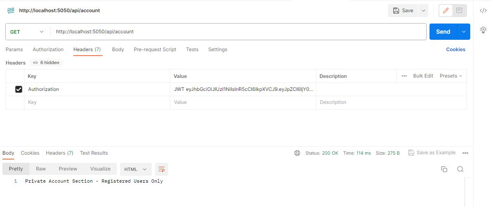

# NodeJS JWT Authentication API

> Building JWT Authentication API With NodeJS and MondogDB using Cluster

```js
// we need start creating the `package.json`
npm init
```

```js
npm i express bcryptjs express-async-handler jsonwebtoken mongoose morgan
```

```js
npm i -D nodemon
```

---

## Setup environment

Let's create a new file `.env` and `.gitignore`

```js
// .env
PORT = 5050
MODE = development
```

```js
// .gitignore
.env
**/node_modules
```

---

## Update type in package.json

> "type": "module" in your package.json file, which instructs Node.js to treat .js files as ES Modules
> In brief: Replace `require` (CommonJS style) with `import` (ESM Style) from now on

```js
...
  "type": "module",
...
```

---

## Connecting to the MongoDb server Cluster

We need Node.js server to rung successfully on port 5050 and it also connected to MongoDB successfully. Just to mention, for simplicity MVC pattern will be in place

## Running server

```js
npm run dev

...
[nodemon] starting `node server.js`
Server running on: 5050
MongoDB is Connected successfully: ac-okc09tz-shard-00-01.ooedapl.mongodb.net
```


---

## Testing API Requests/Responses

### Test POST (invalid)


### Test POST (valid register)


### Test POST (invalid register)


### Test POST (login success after valid register)


### Test GET (login into private router successfully after register)

> TIP: We need to add Headers: `Key`: `Authorization` & `Value`: `<token-value-here>`



---
### :100: <i>Thanks!</i>
#### Now, don't be an stranger. Let's stay in touch!

##### :radio_button: linkedin: <a href="https://www.linkedin.com/in/leolanese/" target="_blank">@LeoLanese</a>
##### :radio_button: Twitter: <a href="https://twitter.com/LeoLanese" target="_blank">@LeoLanese</a>
##### :radio_button: Portfolio: <a href="https://www.leolanese.com" target="_blank">www.leolanese.com</a>
##### :radio_button: DEV.to: <a href="https://www.dev.to/leolanese" target="_blank">dev.to/leolanese</a>
##### :radio_button: Blog: <a href="https://www.leolanese.com/blog" target="_blank">leolanese.com/blog</a>
##### :radio_button: Questions / Suggestion / Recommendation: developer@leolanese.com
